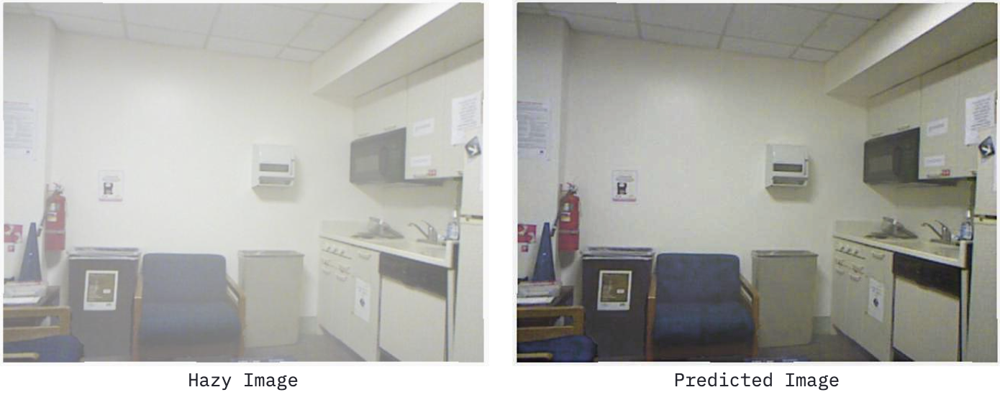
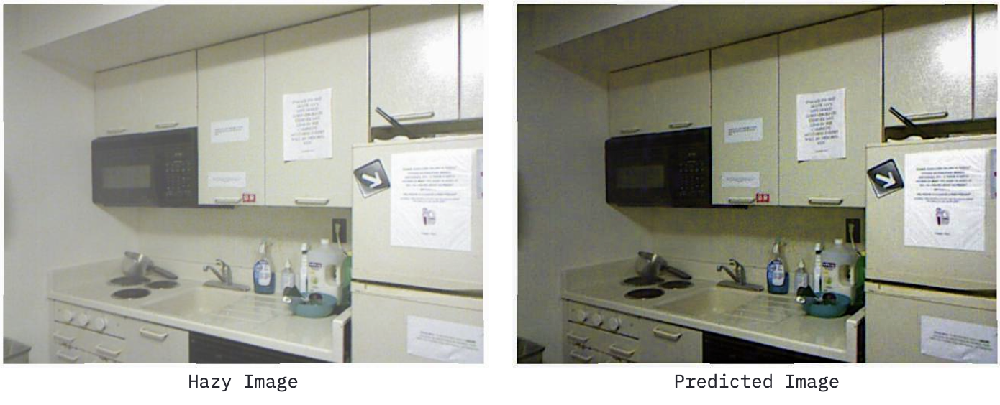
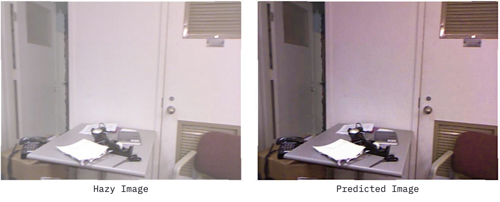
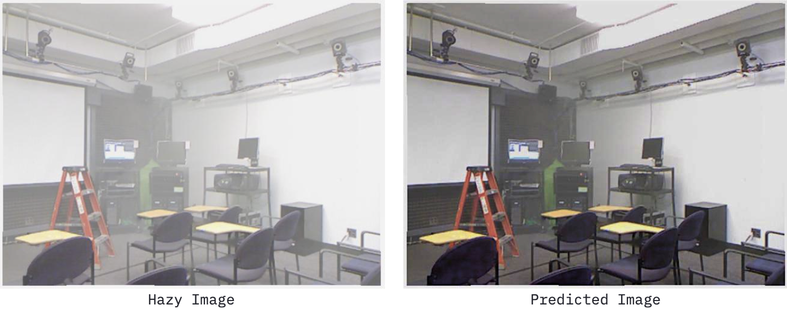
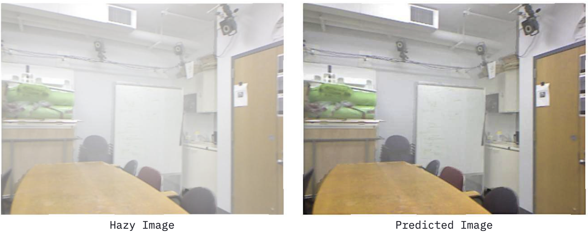
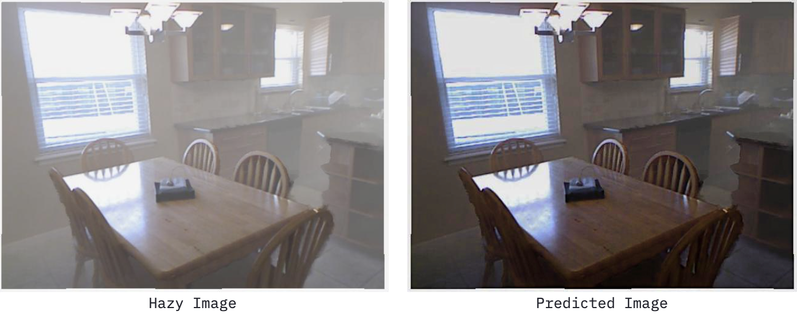
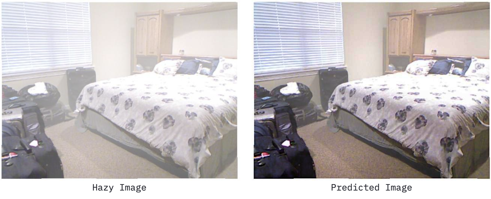
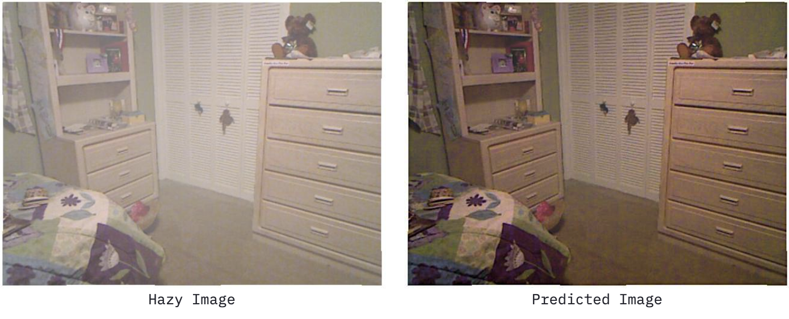

# AODNet

[](https://share.streamlit.io/soumik12345/aodnet/app.py)

Tensorflow implementation of [An All-in-One Network for Dehazing and Beyond](https://arxiv.org/pdf/1707.06543.pdf).


**Training Notebook:** [](https://colab.research.google.com/github/soumik12345/AODNet/blob/master/notebooks/AODnet_Train.ipynb)

**Training Logs:** [https://wandb.ai/19soumik-rakshit96/aodnet](https://wandb.ai/19soumik-rakshit96/aodnet)

## Instructions for running Inference

- `python3 -m pip install -r requirements.txt`

- `python3 -m streamlit run app.py`

## Results



















## Reference

```
@misc{
    1707.06543,
    Author = {Boyi Li and Xiulian Peng and Zhangyang Wang and Jizheng Xu and Dan Feng},
    Title = {An All-in-One Network for Dehazing and Beyond},
    Year = {2017},
    Eprint = {arXiv:1707.06543},
}
```
